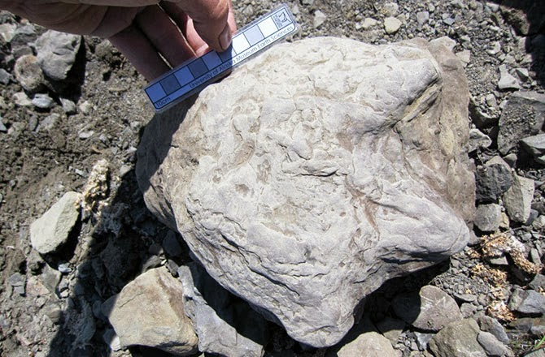

image-pixel-border
==================

Extract the main colour of an image's borders

Example:

 ```javascript
$('#MY_IMAGE_ID').getPixelColor(function(color) {
	$('body').css('background', color);
});
```

Live example:

http://madtrax.github.io/image-pixel-border/

```html
<div style="padding:20px;">
	
</div>

<div style="padding:20px;">
	
</div>
```

```javascript
$(document).on('ready', function() {
    $('#targetImg0').getPixelColor(function(color) { $('#targetImg0').closest('div').css('background', color); });
    $('#targetImg1').getPixelColor(function(color) { $('#targetImg1').closest('div').css('background', color); });
});
```
